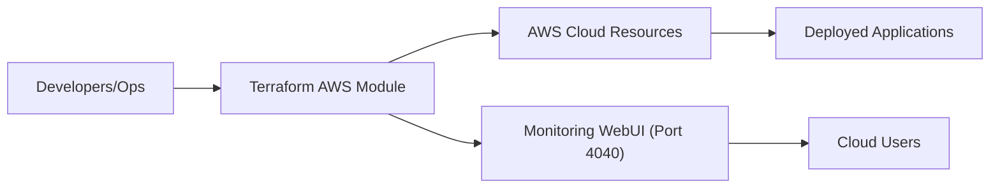

# AWS Infrastructure Automation Module

## Overview
This module automates the provisioning of AWS cloud infrastructure using Terraform. It centralizes the setup of key resources and services required to support applications, enabling repeatable, consistent, and auditable environment deployment. The module is designed for teams seeking to streamline cloud infrastructure management and integrate cloud resource management into deployment pipelines.

## Key Features
- **Automated Resource Provisioning**: Orchestrates the creation of AWS infrastructure components (such as compute, network, and storage) using declarative Terraform scripts.
- **Integrated Monitoring Setup**: Deploys a monitoring solution that is accessible via web on a specific port (e.g., 4040), providing visibility into resource utilization and application health.
- **Infrastructure as Code**: Enables tracking, versioning, and collaboration for infrastructure changes, ensuring consistency across environments and deployments.

## System Errors
- **Terraform Plan or Apply Failure**: Typically caused by missing or misconfigured provider credentials, or invalid variable values.  
  _Resolution_: Check AWS credentials and Terraform variable files. Ensure required permissions are in place.
- **Resource Limit Exceeded**: Encountered if AWS account quotas are reached (e.g., EC2 instance limits).  
  _Resolution_: Review AWS usage and request quota increases if needed.
- **Monitoring Not Accessible**: The monitoring dashboard is unavailable on port 4040.  
  _Resolution_: Confirm that the infrastructure was successfully deployed, security group rules allow traffic on the required port, and the monitoring service is running.

## Usage Examples

```hcl
# Initialize Terraform
terraform init

# Preview proposed changes
terraform plan

# Apply and provision infrastructure
terraform apply

# Access monitoring WebUI (after deploy)
# Open your browser to http://<public-instance-ip>:4040
```

## System Integration


