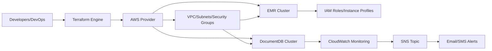

# AWS EMR & DocumentDB Terraform Module

## Overview
This module provisions a scalable AWS environment using Terraform for big data processing and managed MongoDB-compatible DocumentDB. It automates the setup of an Amazon Elastic MapReduce (EMR) cluster for distributed data analytics, a DocumentDB cluster for NoSQL workloads, fully managed networking resources, security groups, role-based access, and cloud monitoring/alerting. The module is designed for teams needing fast, infrastructure-as-code deployments for analytics and database workloads within the AWS EU (Paris) region.

## Key Features

- **EMR Cluster Provisioning**: Deploys a managed Amazon EMR cluster preconfigured with Spark for distributed data processing, leveraging auto-configured EC2 instances.
- **DocumentDB Cluster Setup**: Builds an Amazon DocumentDB (MongoDB-compatible) cluster, supporting HA and secure communication, for application data storage or analytics.
- **Networking Automation**: Creates isolated VPCs, public subnets, route tables, Internet Gateways, and associates them correctly for both EMR and DocumentDB environments.
- **Security Group Management**: Sets up security groups for both clusters, finely controlling inbound/outbound network access.
- **IAM Role and Instance Profile Configuration**: Automatically generates and binds IAM roles and instance profiles, following AWS best practices for EMR operation and EC2 cluster nodes.
- **Resource Tagging**: Applies helpful tags to resources for identification, management, and cost allocation.
- **CloudWatch Monitoring and Alerting**: Deploys CloudWatch alarms for DocumentDB CPU utilization, integrated with an SNS topic for proactive notifications.
- **SNS Notifications**: Sends automated alerts to a designated SNS topic when performance thresholds are breached.

## System Errors

- **Invalid VPC/Subnet Association**: 
  - *Description*: Occurs if the created subnet is not properly associated with the correct VPC or route table.
  - *Resolution*: Ensure subnet and VPC IDs are correctly referenced and route table associations are set up as per the configuration outputs.
  
- **IAM Role Permission Denied**: 
  - *Description*: EMR or EC2 nodes fail to provision if IAM roles/policies are missing required permissions.
  - *Resolution*: Validate the attached policies for both service and instance roles to cover all actions used by EMR and DocumentDB.
  
- **Security Group Misconfiguration**:
  - *Description*: Network communication (e.g., EMR to S3, DocumentDB access) fails if security groups have restrictive rules.
  - *Resolution*: Audit inbound and outbound rules, verify proper VPC and CIDR relationships, and update as needed.
  
- **CloudWatch Alarm Not Triggering**:
  - *Description*: No notifications are sent even if DocumentDB CPU spikes.
  - *Resolution*: Check alarm configuration (metric, dimensions, threshold), SNS topic ARN, and permissions.

## Usage Examples

```hcl
module "emr_docdb_stack" {
  source = "github.com/PaulMazeau/HETIC-Terraform-aws"

  # This module requires no mandatory input variables in its current form.
  # Customize as needed for VPC, subnet, EMR, or DocumentDB parameters.
}

# After applying, EMR and DocumentDB clusters are available.
# Access EMR Job Tracker via AWS Console and connect to DocumentDB using
# the connection endpoints provided in Terraform outputs (configure MongoDB client).
```

## System Integration


- **Dependencies**: AWS Provider, IAM, VPCs/Subnets
- **This Module**: Orchestrates infrastructure provisioning, IAM roles, and monitoring configuration
- **Used By**: Data engineer pipelines, analytics jobs, application backends requiring EMR or DocumentDB

**[Details]:**  
- Custom VPCs and networking for isolation.  
- Security group management enforces least-privilege access.  
- IAM configurations support secure operation of big data and database services.

**[Process]:**
- Provision of network and security foundations
- Automated spin-up of EMR and DocumentDB clusters
- Integration of roles, policies, and monitoring

**[Consumers]:**
- Development and analytics teams via AWS Console, CLI, SDK, or directly via endpoints and notifications.