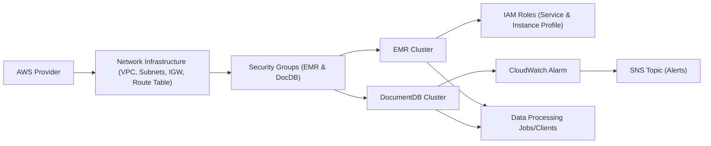

# Architecture Overview

## Overview
This Terraform module provisions an AWS-based architecture centered around scalable data processing and managed database capabilities. The core components include an Amazon EMR cluster for big data processing, an Amazon DocumentDB cluster for document storage, and supporting networking and security resources. The module is designed to provide a production-ready cloud environment for data engineering workloads, with configurable VPCs, security, IAM roles, and integrated monitoring.

## Key Features
- **EMR Cluster Provisioning**: Deploys a Spark-enabled Amazon EMR cluster for distributed data processing tasks, including the configuration of core and master nodes.
- **DocumentDB Cluster Setup**: Creates a highly available Amazon DocumentDB (MongoDB-compatible) cluster for persistent document storage, including subnet groups for multi-AZ deployment.
- **Network Infrastructure**: Sets up dedicated VPCs, subnets, internet gateways, and route tables to isolate and connect the EMR and DocumentDB components securely.
- **Security Groups**: Defines and associates custom security groups for both EMR and DocumentDB resources, enabling controlled network access.
- **IAM Role Management**: Establishes service and instance IAM roles with appropriate permissions for EC2, EMR, and other AWS services to interact securely.
- **CloudWatch Monitoring & Alerts**: Configures a CloudWatch alarm to monitor DocumentDB CPU utilization and integrates with SNS for alerting on threshold breaches.
- **Service Integration**: Ensures seamless interoperation between data processing (EMR), storage (DocumentDB), security, and monitoring layers.

## System Errors
- **VPC/Subnet Misconfiguration**: Misaligned or missing subnet, VPC, or internet gateway resources may prevent EMR or DocumentDB startup.  
  *Resolution*: Ensure all required subnets, VPC CIDR blocks, and internet gateways are correctly defined and associated.
- **IAM Permission Denied**: If roles lack necessary permissions, cluster creation or service actions may fail.  
  *Resolution*: Double-check IAM role policies attached to both the EMR service and EC2 instance profiles.
- **Security Group Connectivity Issues**: Restricted or missing ingress/egress rules can block network access to EMR or DocumentDB nodes.  
  *Resolution*: Review security group rules and ensure necessary ports and CIDR ranges are open as required.
- **Resource Naming Conflicts**: Duplicate names for AWS resources can cause Terraform apply failures.  
  *Resolution*: Use unique identifiers or suffixes for resources, especially when creating multiple stacks.

## Usage Examples

```hcl
// Initialize providers and backend (optional)

// Deploy main EMR and VPC
module "data-platform" {
  source = "./this-module-directory"
  // Optionally override resource names, CIDR blocks, etc.
}

// Output relevant resource information
output "emr_master_dns" {
  value = aws_emr_cluster.cluster.master_public_dns
}

output "docdb_endpoint" {
  value = aws_docdb_cluster.docdb.endpoint
}
```

## System Integration



- **Dependencies**: AWS Provider, VPCs, subnets, internet gateways, and route tables.
- **This Module**: Provisions EMR and DocumentDB clusters, security groups, IAM roles, and monitoring resources.
- **Used By**: Data engineering workloads (Spark jobs), application backends, data scientists, and monitoring/alerting workflows.
- **Integration Points**: 
  - EMR interacts with S3, EC2, and DocumentDB over the defined network and security setup.
  - CloudWatch and SNS provide observability and alerting for operational monitoring.