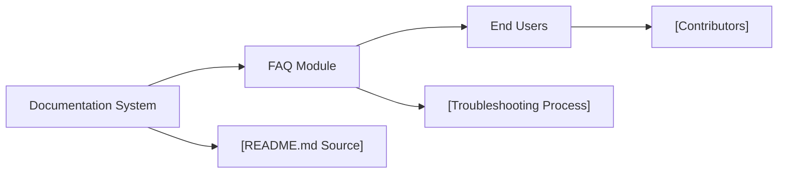

# FAQ Module

## Overview
The FAQ module provides a centralized place for users to find answers to common questions regarding the usage, configuration, and troubleshooting of the Terraform AWS infrastructure starter. It aims to reduce onboarding time and help resolve operational issues quickly by aggregating frequently asked questions and solutions.

## Key Features
- **Centralized Knowledge Base**: Offers an easily accessible collection of commonly faced issues and their resolutions related to infrastructure deployment and monitoring.
- **Troubleshooting Guidance**: Provides step-by-step solutions for typical errors encountered during deployment or while using monitoring features.
- **Integration Instructions**: Clarifies usage patterns and recommended practices for integrating infrastructure and monitoring components.
- **Update and Contribution Guidance**: Informs users how to contribute new questions or update existing answers to keep the FAQ relevant.

## System Errors
It's important to document common errors and troubleshooting steps:
- **Deployment Failure**: If the infrastructure fails to deploy due to missing AWS credentials, ensure your AWS CLI is configured and the credentials are up-to-date.
- **Monitoring Unavailable**: If the monitoring page is not accessible on port 4040, check that the monitoring service is running and there are no network/firewall restrictions.
- **Resource Limit Exceeded**: If AWS returns resource limit errors, review your account quotas and release unused resources before redeploying.
- **Module Version Mismatch**: If Terraform reports that providers or modules are incompatible, update your local dependencies to the required versions as specified in the starter repository.

## Usage Examples
Practical usage scenarios for consulting or contributing to the FAQ:

```markdown
// Accessing answers:
- Question: "How do I access the Spark WebUI for monitoring?"
  Answer: "Visit http://<your-server-ip>:4040 in your browser after deployment."

// Asking a new question:
1. Clone the repository.
2. Edit the .shelfya/starter/faq.md file by adding your question and answer.
3. Submit a pull request.

// Troubleshooting:
- Issue: "I can't see monitoring data."
  Solution: "Ensure the monitoring service is deployed and accessible through security group/firewall settings. See the FAQ entry on Monitoring Unavailable."
```

## System Integration
