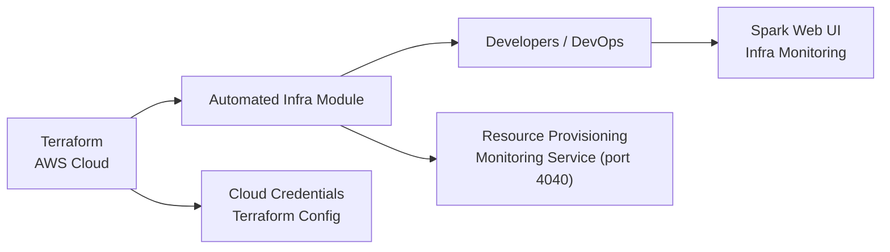

# Terraform AWS Starter

## Overview
This module provides an automated way to provision and manage AWS infrastructure using Terraform. It simplifies the deployment of core cloud resources and includes built-in monitoring support, ensuring both scalability and operational visibility for developers and DevOps teams.

## Key Features
- **Automated Infrastructure Provisioning**: Streamlines the creation and setup of AWS resources such as compute instances, networking, and storage components via Terraform.
- **Integrated Monitoring**: Deploys a basic monitoring stack accessible through a web interface (typically on port 4040), allowing real-time visibility into the health and performance of the deployed infrastructure.
- **Spark Web UI Access**: Enables monitoring and management of Apache Spark jobs directly through the Spark Web UI.

## System Errors
- **Failed Terraform Apply**: Occurs when resource provisioning fails (e.g., invalid credentials, unsupported resource configuration).  
  **Resolution**: Check AWS credentials and validate your Terraform configuration files for correctness.
- **Monitoring Endpoint Unreachable (Port 4040)**: The monitoring dashboard is not accessible, possibly due to network security settings or failed service startup.  
  **Resolution**: Verify network security group/firewall rules and ensure the monitoring service is running on the target instance.

## Usage Examples

```hcl
// Initialize Terraform
terraform init

// Preview infrastructure changes
terraform plan

// Apply infrastructure changes
terraform apply

// After deployment, access the monitoring interface via http://<public-ip>:4040
```

## System Integration


